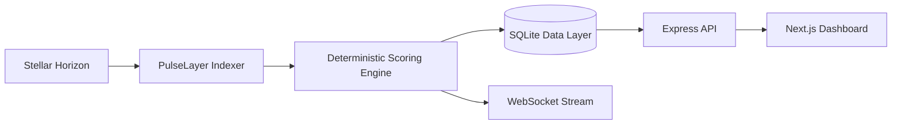

# PulseLayer ⚡

Real-time trust intelligence and risk analytics for the Stellar ecosystem.

[](https://stellar.org)
[](https://nextjs.org)
[](https://react.dev)
[](https://www.typescriptlang.org)
[](https://expressjs.com)
[](https://github.com/WiseLibs/better-sqlite3)
[](LICENSE)

---

## Why PulseLayer exists

The Stellar network is transparent, fast, and globally accessible, but it lacks a standardized, human-readable trust layer for wallet screening, institutional due diligence, counterparty assessment, and risk monitoring.

PulseLayer fills that gap by turning raw on-chain activity into a deterministic, explainable trust signal. It watches Stellar account behavior in real time, evaluates patterns over time, and produces a score that helps users understand whether an address is behaving like a healthy, active participant or an anomalous, risky, or inactive account.

This project is intentionally designed to be reviewable by both humans and automated evaluators: it has a clear architecture, deterministic scoring logic, transparent signal explanations, open-source code, and a contributor workflow aligned with public-good funding standards.

---

## What PulseLayer does

PulseLayer ingests Stellar mainnet activity, analyzes account behavioral patterns, and exposes a real-time trust score through a dashboard and API.

Core capabilities:

- Live Horizon monitoring for Stellar activity
- Deterministic trust scoring from public account behavior
- Real-time anomaly detection for bursty, suspicious, or unstable patterns
- Risk breakdowns and audit-friendly signal explanations
- Historical trend data for account performance over time
- Searchable and filterable account leaderboard
- Read-only infrastructure for public network analysis

The result is a tool that can support:

- wallet risk screening
- compliance and account review workflows
- ecosystem monitoring for counterparties
- better visibility for and trust in on-chain activity
- future integrations with investment, analytics, and compliance tools

---

## Problem statement

In the Stellar ecosystem, there is a critical need for transparent behavioral risk intelligence that is not locked behind private APIs or opaque scoring models. Most users and institutions still rely on fragmented signals, manual checks, or ad hoc heuristics.

Without a reusable trust layer, it remains difficult to:

- evaluate a wallet or address systematically
- compare network participants consistently
- detect suspicious operational behavior early
- improve user trust and wallet safety
- build public-good tooling for ecosystem health

PulseLayer provides a transparent and extensible foundation for this analysis.

---

## Solution overview

PulseLayer combines a real-time indexer, deterministic scoring engine, and a web dashboard into one open-source project.

The system:

1. Reads public Stellar account and transaction data
2. Scores behavioral signals using a transparent formula
3. Flags anomalous conditions such as sudden bursts, liquidity stress, and low-confidence patterns
4. Stores historical snapshots for trend analysis
5. Exposes data through a REST API and WebSocket feed
6. Makes results visible through a dashboard for human review and operational decision-making

This makes the project valuable not only as a product, but also as a public-good infrastructure layer for the Stellar ecosystem.

---

## Technical architecture



The architecture is intentionally modular and straightforward:

- `server/indexer.ts` ingests live network data
- `server/scoring.ts` contains the scoring and anomaly logic
- `server/db.ts` manages persistence and indexing
- `server/server.ts` exposes API and WebSocket endpoints
- `src/` contains the UI and interactive analytics layer

For deeper implementation details, see [ARCHITECTURE.md](ARCHITECTURE.md).

---

## Deterministic scoring model

PulseLayer computes a score in the range $[0, 100]$ using a transparent and explainable formula that balances positive network behavior with risk penalties.

$$
S = \mathrm{clamp}\left(\sum_{i=1}^{n} w_i F_i - \Delta_{anomaly},\ 0,\ 100\right)
$$

Where:

- $F_1$ reflects account age and lifespan quality
- $F_2$ reflects transaction consistency and velocity
- $F_3$ reflects balance and liquidity depth
- $F_4$ reflects trustline diversity and network participation
- $F_5$ reflects counterparty quality and success behavior
- $\Delta_{anomaly}$ applies penalties for suspicious burst behavior, low-signal patterns, or instability

The model is not a black box: each score is associated with the signals that informed it.

---

## Why this project is grant- and review-ready

This repository is structured to support credible ecosystem review by both AI-driven analysis and human evaluators.

It includes:

- a clear technical problem and solution statement
- modular system design and project structure
- open and auditable scoring logic
- transparent API and data flows
- deployment configuration for real-world use
- security-conscious implementation and documentation
- a contributor model that requires review through pull requests

This positioning makes the project suitable for public-good, ecosystem, and grant-style review frameworks where technical clarity, reproducibility, and maintainability matter.

> Note: grant eligibility depends on the specific program, its rules, and the submission period. This repository is intentionally organized to support that review process, but final suitability is determined by the funding body.

---

## Roadmap

Our near-term direction is documented in [FUTURE_PLAN.md](FUTURE_PLAN.md). The core roadmap priorities include:

- improving score transparency and explainability
- expanding anomaly detection quality
- hardening deployment and production reliability
- supporting more ecosystem integrations
- publishing a broader contributor and governance model
- preparing for external grant, accelerator, and ecosystem funding submissions

---

## Quick start

### Prerequisites

- Node.js 20+
- npm 10+

### Install and run

```bash
git clone https://github.com/Justice989810/Pulse-Layer.git
cd Pulse-Layer
npm install
npm run dev
```

### Local access

- Dashboard: http://localhost:3000
- API: http://localhost:5001/api/stats
- WebSocket: ws://localhost:5001/ws

---

## Deployment

This project is prepared for deployment across common hosting models. See [DEPLOYMENT.md](DEPLOYMENT.md) for instructions covering:

- Render
- Railway
- Vercel + backend hybrid patterns
- Docker and Docker Compose

---

## API overview

### REST endpoints

| Method | Endpoint | Description |
|---|---|---|
| GET | `/api/stats` | High-level network and indexer metrics |
| GET | `/api/score/:account` | Trust score and signal breakdown for an account |
| GET | `/api/history/:account` | Historical score snapshots |
| GET | `/api/top` | Ranked account directory with filters |
| GET | `/api/feed` | Recent activity feed |
| GET | `/api/export/:account` | Structured JSON export for account audit review |

### WebSocket feed

- Endpoint: `/ws`
- Purpose: real-time broadcast of live Stellar events and updates

---

## Security and transparency

This project is intentionally designed with a read-only, non-custodial operational model:

- only public Stellar account data is accessed
- no private keys are required
- database access is parameterized and guarded
- security headers are applied to API responses
- public security disclosures are documented in [SECURITY.md](SECURITY.md)

---

## Project structure

```text
Pulse-Layer/
├── server/
│   ├── db.ts
│   ├── indexer.ts
│   ├── scoring.ts
│   └── server.ts
├── src/
│   ├── app/
│   ├── components/
│   ├── context/
│   └── lib/
├── ARCHITECTURE.md
├── CONTRIBUTING.md
├── DEPLOYMENT.md
├── FUTURE_PLAN.md
├── SECURITY.md
├── README.md
├── docker-compose.yml
├── Dockerfile
├── Procfile
├── next.config.ts
├── package.json
├── railway.json
├── render.yaml
├── LICENSE
└── tsconfig.json
```

---

## Contributing

We welcome contributions from developers, researchers, and ecosystem builders. All changes should be proposed through a pull request, reviewed, and merged according to the repository contribution standards in [CONTRIBUTING.md](CONTRIBUTING.md).

---

## License

This project is open-source software licensed under the [MIT License](LICENSE).
